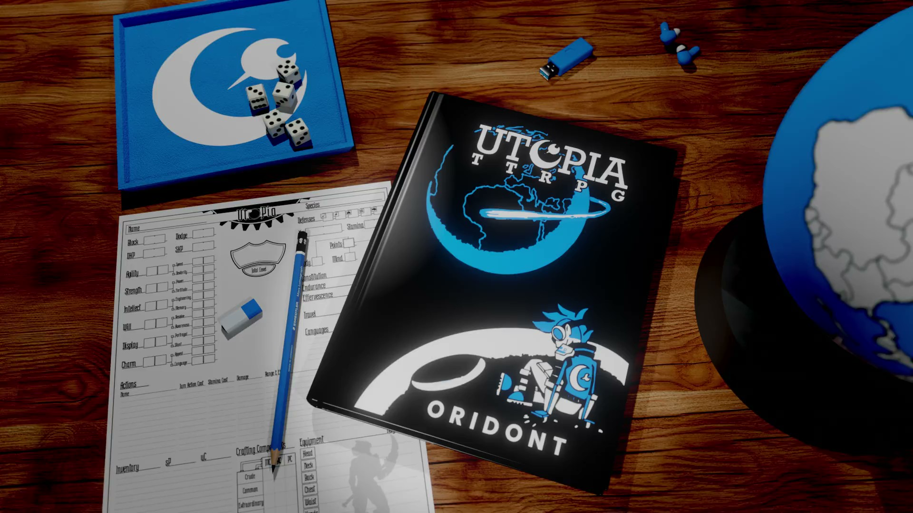
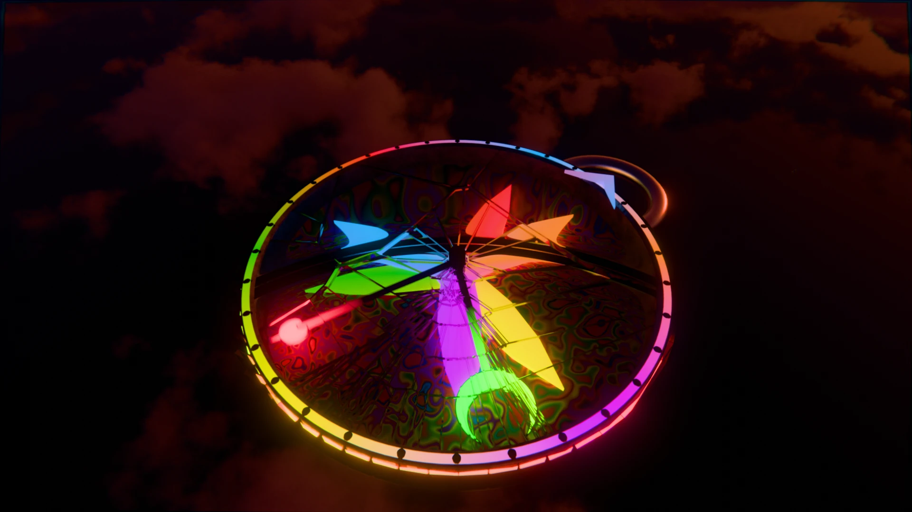
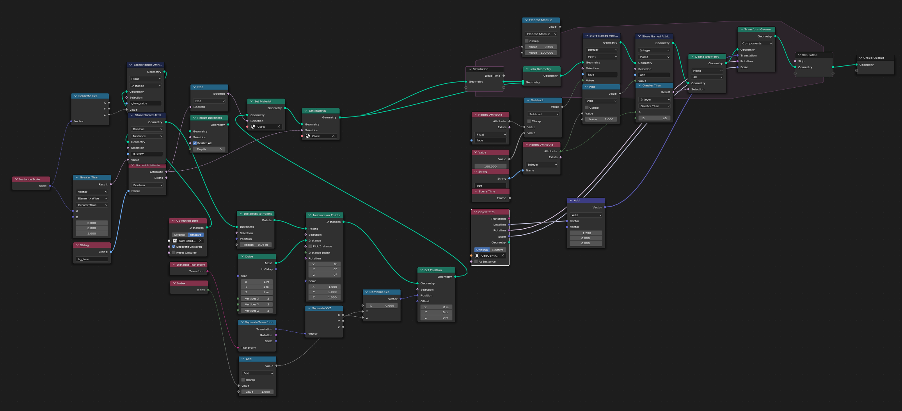

import YouTube from "../../components/Youtube.astro";

Blender is one of those tools that never really feels like a “job” to me. Even when I’m grinding through UV maps or fighting with geometry nodes, I end up getting pulled into a kind of flow state. There’s something rewarding about starting with an empty scene and slowly pulling a shape, a texture, or an effect into existence.  

*A 3D rendering of the Utopia TTRPG game book and character sheet. Spotlighted on the <a href="https://myramyth.com/utopia">Myramyth - Utopia TTRPG</a> website*

I think part of it is the sense of discovery. When I’m working on a model; whether it’s a fantasy shield, a strange piece of tech, or just an experimental render, I’m asking myself, *what if this was real?* What purpose would it serve? How would it look in the hands of a character or inside a game world? That simple question keeps me curious.  

*A complex compass based on the Compass Theory from <a href="https://myramyth.com/compass">Myramyth</a>*

The best part is how transferable it is. A render in Blender doesn’t stay locked in Blender. It becomes a game asset, a product mockup, or a visual for my tabletop projects. I’ve built everything from TTRPG gear illustrations to design experiments for personal projects, and each one has taught me something new about shape, light, and storytelling.  

I’ve also noticed how much Blender overlaps with coding. Both require patience, iteration, and a willingness to break things just to see how they work. When I’m writing a shader node graph, it feels a lot like debugging a tricky function: step by step, piece by piece, until everything clicks into place.  

*Geometry Nodes from a Real-time Audio Visualizer setup (See video below for context)*

Recently, I had the experience of developing a live audio visualizer in Blender with the help of extensions. Alongside the help of AI, I modified an existing Audio Visualizer add-on to support pass-through audio, taking an incoming audio feed from a virtual audio cable, and piping it through a python function to display frequency data on an array of objects.

<YouTube id="eVhi5P5Nw6w" title="Blender Timelapse" />
*A full-length example of the Blender audio visualizer in action, visualized in the Viewport, live.*

For me, Blender isn’t just a creative outlet, it’s a lab. A place where I can experiment freely, make mistakes without consequence, and end up with something that might inspire the next project. Sometimes it’s art, sometimes it’s utility, but it’s always progress.  

---

*Render complete.* 🎨

<a href="/blog">Back</a>
